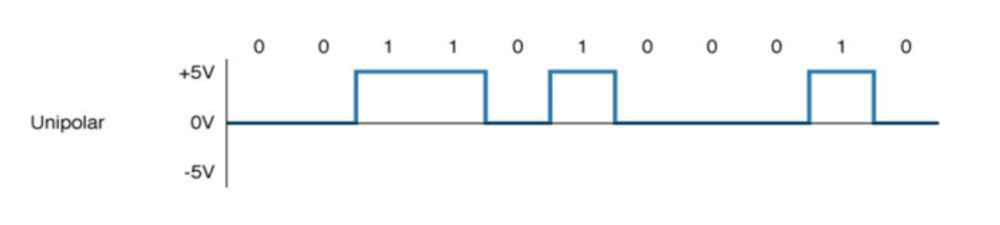
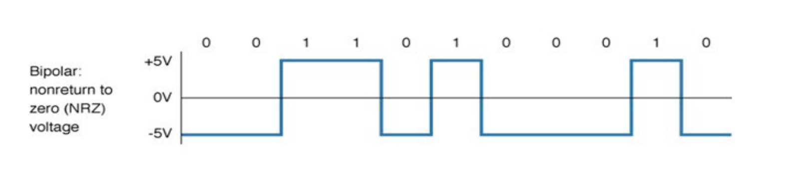
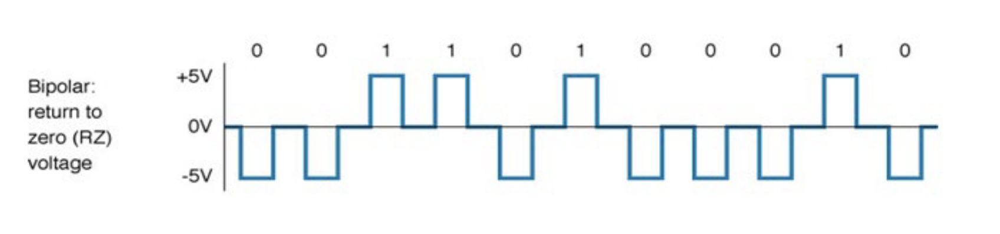
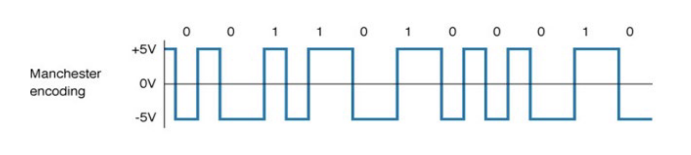

## Week 1
	- ### Network Types
		- Personal Area network (PAN)
			- Consists of personal devices such as a cell phone and notebook such as bluetooth and infrared
		- Local Area Network (LAN)
			- Covers a small local area such as a home, office or other building
		- Wireless LAN
			- Covers a limited area and is popular in places where cables are difficult to install such as wireless LTE 4G or WiMax
		- Metropolitan Area Network (MAN)
			- Covers a large geographic area such as university campuses or cities
		- Wide Area Network (WAN)
			- Covers a large geographic area and is made up of small networks
			- WAN is best known as the internet
	- ### Data Communications
		- ### Telecommunications
			- Older networks only covered voice telephones and telegraph communications (Telecommunications)
			- Newer networks cover all forms of communications including data communication (data communication)
- ## Week 2
	- ### Backbone Networks
		- A Backbone Network (BN) is a high speed network (1/10/40/100Gbps) that interconnects many networks such as LANs, MANs, and WANs as well as the internet
		- Has a number of components such as (Routers, Switches, Gateways, etc)
		- **Types of Backbones**
			- Switched backbone
			- Router backbone
	- ### Communications Media
		- Medium is the physical matter that carries the transmission
		- Two basic categories of media
			- **Guided Media**
				- Three main types of guided media
					- *Coaxial Cable*
					- *Copper Cable (Twisted Pair)*
					- *Optical Fiber Cable*
			- **Wireless Media**
				- Main forms of wireless communications
					- *Radio*
					- *Infrared*
					- *Microwave*
					- *Satellite*
	- ### Types of Twisted Pair Cables
		- 10BaseT
			- 10Mbps, Category 3 UTP, 100m limit
		- 100BaseT
			- 100Mbps, Category 3 UTP, 100m limit
		- 1000BaseT
			- Cat5e, Cat6, Cat6a, Cat7, Cat8#
	- ### Types of Ethernet Cable
		- 10Base2
			- 185 - 200 meters distance limit
		- 10Base5
			- 500 meters distance limit
		- 10BaseT
			- 100 meter distance limit
		- 100BaseT
			- 100 meter distance limit
	- ### OSI Model
		- Layer 1 - Physical
			- Physical Medium (i.e. Coax, Twisted Pair, Fiber, Radio, etc)
		- Layer 2 - Data Link
			- Frames (Ethernet, Switch, etc)
		- Layer 3 - Network
			- Packets (IP, ICMP, etc)
		- Layer 4 - Transport
			- End-to-End Encryptions (TCP, UDP, etc)
		- Layer 5 - Session
			- Synch and Send to Port (APIs, Sockets, Webhooks)
		- Layer 6 - Presentation
			- Syntax Layer (SSL, SSH, FTP, etc)
		- Layer 7 - Application
			- End User Layer (HTTPS, FTP, SSH, DNS, etc)
	- ### Week 2 Questions
		- How do LANs differs from MANs, WANs and BNs?
			- A LAN is a local network, designed to be used only for small networks over a short distance.
		- Describe three types of guided media
			- Coaxle
			- Twisted Pair (Copper Cables)
			- Fiber Optics (Fiber Cables)
		- Describe four types of wireless media
			- Radio
			- Infrared
			- Microwave
			- Satellite
		- Compare wired and wireless media
			- Wireless media is much easier and cheaper to install
			- Wired media is less prone to interference than wireless media
- ## Week 5
	- ### Data Flow
		- Simplex
			- Data flows move in only one direction
		- Half-Duplex
			- Data flows both ways, but in only one direction at a time
		- Full Duplex
			- Data flows both directions at the same time
	- ### Digital Transmission
		- **Unipolar**
			- Voltage is always positive (+, 1, on) or negative (-, 0, off)
			- One voltage for 0, and another voltage for 1s (eg. 5 Volts for 1 and 0 Volts for 0)
			- 
		- **Bipolar: NRZ (No return to 0)**
			- 1's and 0's vary from a plus voltage to a minus voltage (+5v for 1 and -5v for 0)
			- Doesn't return to 0 volts after each bit
			- 
		- **Bipolar: RZ (Return to 0)**
			- 1's and 0's vary from a plus voltage to a minus voltage (+5v for 1 and -5v for 0)
			- Returns to 0 after each bit
			- 
		- **Manchester Encoding**
			- *Special type of bipolar* signalling in which the signal is changed from *high to low* or from *low to high* in the middle of the signal
			- Change from high to low = 0
			- Change from low to high = 1
			- 
- ## Week 6
	- ### Multiplexing
		- Multiplexing is a way of sending multiple signals or streams of information over a communications link at the same time in the form of a single, complex signal
		- The main advantage of Multiplexing is cost
			- Multiplexing is cheaper due to needing fewer network links
	- ### Transmission Types
		- **Asynchronous Transmission**
			- Asynchronous Transmission is the transmission of data in which each character is a self contained unit with its own start and stop bits and an uneven interval between them
			- Each character is sent independently
			- Sometimes called start-stop transmission
		- **Synchronous Transmission**
			- Synchronous Transmission is a data transfer method in which a continuous stream of data signals is accompanied by timing signals (generated by an electric clock) to ensure that the transmitter and the receiver are in step with each other
	- ### Parity Checking
		- **Odd Parity**
			- 1010001? = 3/1's = 0
			- 1101001? = 4/1's = 1
		- **Even Parity**
			- 1010001? = 3/1's = 1
			- 1101001? = 4/1's = 0